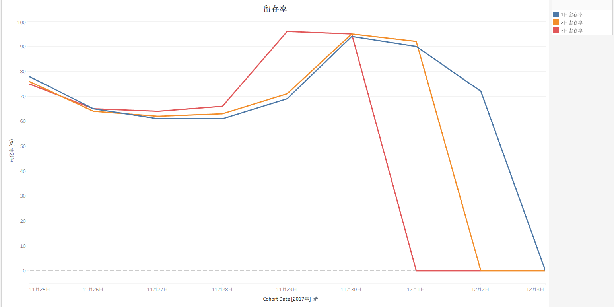
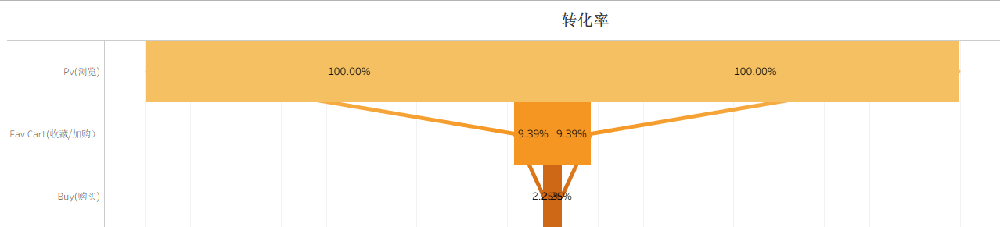
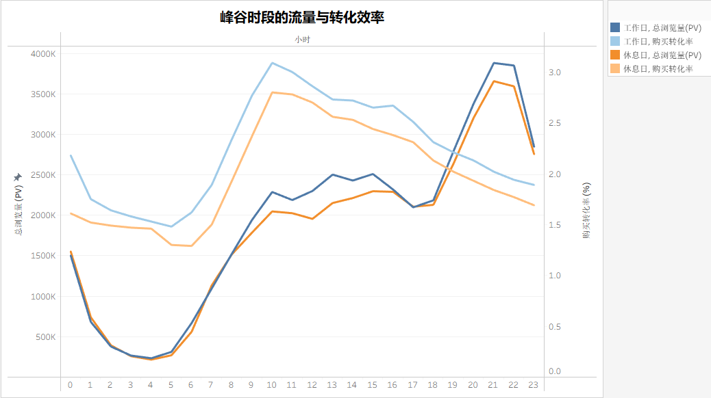
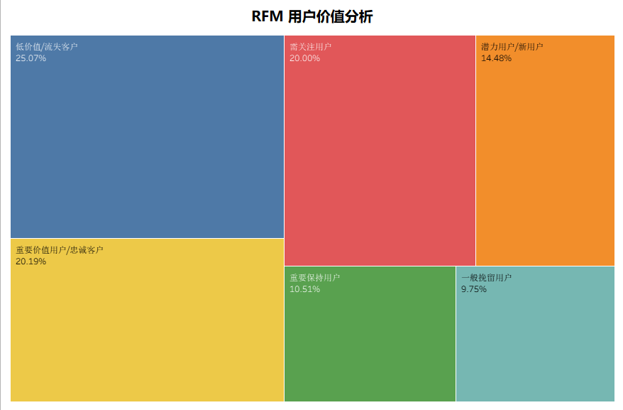

# 🛒 电商用户行为深度分析报告：策略优化与瓶颈诊断

## 🚀 项目概览

本项目基于真实的电商平台（淘宝）用户行为数据，旨在通过深入、多维度的数据分析，诊断用户行为模式、转化流失瓶颈，并为平台的精细化运营、商品推荐和用户价值维护提供数据驱动的策略建议。

* **数据来源:** 阿里巴巴天池数据集 649 (用户行为数据) **[https://tianchi.aliyun.com/dataset/649](https://tianchi.aliyun.com/dataset/649)**
* **分析目标:** 优化用户体验，提高平台整体转化效率和用户忠诚度。
* **分析框架:** 围绕用户生命周期、交易效率和商品价值的五个核心业务问题展开。

## 🛠️ 技术栈

### 1. 技术栈

| 领域 | 工具/技术 | 用途 |
| :--- | :--- | :--- |
| **数据处理与建模** | Python (Pandas), SQL | 数据清洗、特征工程、RFM 模型构建 |
| **数据存储** | SQL/SQLite | 结构化数据查询与聚合计算 |
| **可视化** | Tableau, Matplotlib | 制作留存曲线、小时趋势图、RFM 分群与战略定位矩阵 |

### 2. 数据清洗与规范化

1.  **时间窗口确认:** 排除了时间戳的极端异常值（如 1902 年、2027 年），将分析时间范围精确限定在 **2017-11-25 至 2017-12-03**，确保了分析的有效性。
2.  **行为归类:** 将 `fav`（收藏）和 `cart`（加购）合并为 **“兴趣行为”**，简化了转化漏斗，聚焦于用户从兴趣到购买的决策流程。

## 🧠 核心分析与结论 

### Q1: 用户留存与生命周期分析

* **结论:** 分析期内，**老用户占比高达 99.97%**，表明在“双十二”预热阶段，平台对**新用户的吸引力严重不足**，拉新效果不佳。
* **建议:** 紧急调整营销预算和策略，推出针对**新用户首单**的重磅、专属优惠活动，重点解决新用户导入问题。

### Q2: 转化漏斗分析（宏观流失诊断）

* **目标:** 识别用户从浏览到购买的最大流失点。

| 漏斗阶段 | 转化率 | 诊断与重点 |
| :--- | :--- | :--- |
| **PV $\to$ 兴趣行为(Fav/Cart)** | 9.39% | 91% 的流量在浏览后直接流失，流量可能不够精准，或者商品详情页缺乏足够的说服力导致用户连暂存的欲望都没有。 |
| **兴趣行为 $\to$ 购买 (Buy)** | 23% | 77% 已经表现出明确兴趣（加购/收藏）的用户最终放弃了支付。通常原因集中在：结算页发现隐藏成本（如运费）、未能凑齐满减门槛、竞品出现更低价格，或仅仅是等待大促降价。 |

* **运营建议:**
    * **提升意向留存率：** 在商品列表页直接外露一键加购或一键收藏按钮，减少进入详情页的步骤。在详情页增加如近期销量、好评率等信任背书指标，刺激用户先加入购物车。
    * **情绪营销:** 当商品库存低于特定阈值，或商品即将恢复原价时，向收藏/加购该商品的用户发送定向推送或短信（如：“您关注的商品仅剩 2 件 / 即将涨价”）。

### Q3: 小时级流量与效率分析

* **目标:** 区分流量规模和购买效率，指导精准资源分配。

| 时段 | 指标 | 发现 | 运营策略 |
| :--- | :--- | :--- | :--- |
| **上午 (10:00)** | **转化效率 CR** | 转化率达到**峰值**，用户购买意愿最强。 | **🎯 集中转化:** 推广高价值、高毛利商品，以转化为核心目标。 |
| **晚间 (21:00)** | **流量 PV** | 流量达到**峰值**，但转化效率急剧下降。 | **📢 引导兴趣:** 避免消耗高价值促销资源，将重点转向**品牌曝光**和**引导用户加购/收藏**。 |

### Q4: RFM 用户价值分群分析

* **目标:** 依据用户价值进行分群，制定差异化营销策略。
* **方法:** 采用 **R-F 模型** (Recency-Frequency)，将用户划分为 6 大群体。

| RFM 群组 | 占比 | 核心特征 | 营销策略 |
| :--- | :--- | :--- | :--- |
| **重要价值用户** | 20.19% | 近期购买、购买频次高。 | **奖励/维系:** 提供 VIP 专属服务或提前享受活动，巩固忠诚度。 |
| **低价值/流失客户** | 25.07% | 购买间隔久、购买频次低。 | **唤醒/召回:** 通过低门槛优惠券或**针对性商品推荐**刺激回购。 |
| **潜力用户/新用户** | 14.48% | 近期购买、购买频次低。 | **加速转化:** 推送新手礼包，通过交叉销售将其转化为忠诚客户。 |

### Q5: 商品类别表现分析（战略定位矩阵）

* **目标:** 评估商品品类的规模、潜力（复购频次）和效率（转化率）。

| 品类ID | 转化率 (%) | 购买频次 (潜力) | 战略定位 |
| :--- | :--- | :--- | :--- |
| **2885642, 1464116** | $\approx 18\%$ | 中等 | 效率高，应加大投入，作为**拉新主推品**。 |
| **4756105, 4145813** | $\approx 5.79\% - 7.47\%$ | 中等到高 | 高流量但低效率。需**立即诊断**商品详情、价格或评论，修复用户流失。 |
